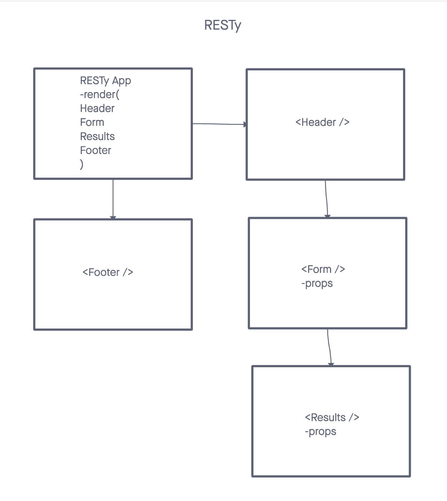

# RESTy

RESTy is a React-based API testing application. In its initial phase, the app provides a basic interface to test APIs using different HTTP methods.

## Phase 1: Application Setup

- Basic React Application
- Scaffolding
- Basic State
- Rendering

## Phase 2: User Input and State

- Convert App to functional
- Implement useState()
- Capture user input
- Test UI and state

## Phase 3: API Integration

- Connect to live APIs
- Service GET requests
- Display response data
  
## URLs

- 
- [PR 1](https://github.com/KatKho/resty/pull/1)
- [PR 2](https://github.com/KatKho/resty/pull/3)
- [PR 3](https://github.com/KatKho/resty/pull/4)

## Contributors

- Ekaterina Khoroshilova
- ChatGPT has been utilized for tests
